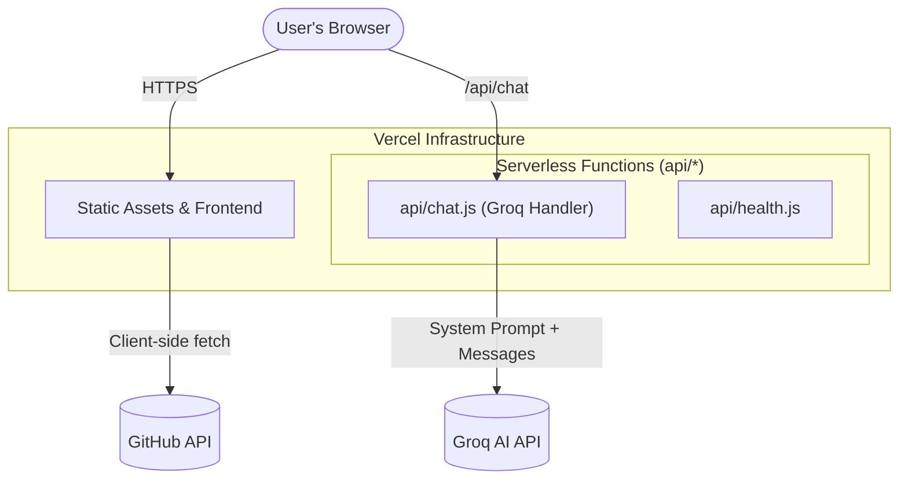

# Portfolio V4 - Arin Jain


A modern, high-performance, and interactive developer portfolio. This version (v0.5.0) features a fully serverless backend migration, enabling seamless deployment on Vercel with integrated AI capabilities.

## Documentation

- [Changelog](CHANGELOG.md): Detailed release history and migration notes.
- [Contributing](CONTRIBUTING.md): Guidelines for contributing to this project.
- [Code of Conduct](CODE_OF_CONDUCT.md): Standards for our community.
- [Security Policy](SECURITY.md): Reporting vulnerabilities and security updates.
- [License](LICENSE): MIT License details.

## Key Features

- **AI Assistant (Groq-Powered)**: A context-aware chat interface. It knows everything about my portfolio, experience, and projects. 
- **Interactive Journey Map**: Visualize my career path with a Leaflet-integrated map featuring custom markers and period-based data.
- **Reactive Theme System**: Interactive "Vibe Check" allowing users to cycle through Neon, Retro, Minimal, and Modern themes.
- **Physics Playground**: A gravity-based interactive mode using Matter-js for a playful user experience.
- **Dynamic Content**: 100% JSON-driven. Update the entire site content by editing `portfolio.json`.
- **Functional Terminal**: A retro-style CLI to explore the portfolio using commands.
- **Performance First**: Built with React 19 and Vite for near-instant load times and smooth 60fps animations.

---

## Architecture

The portfolio follows a modern serverless architecture, hosted entirely on Vercel.



---

## Project Structure

```text
.
├── api/                # Vercel Serverless Functions (The Cloud Backend)
│   ├── chat.js         # Groq AI implementation
│   └── health.js       # Deployment status check
├── src/                # Frontend Source
│   ├── components/     # Modals, Hero, Journey, Projects
│   ├── data/           # portfolio.json, versions.json
│   ├── hooks/          # useSound, useTheme, etc.
│   └── index.css       # Core Design System
├── public/             # Static Assets (Images, PDFs)
├── server/             # Local Development Server (Express)
├── vercel.json         # Routing & SPA Configuration
└── vite.config.js      # Build & Dev Proxy settings
```

---

## Technical Stack

- **Frontend**: [React 19](https://react.dev/), [Vite](https://vitejs.dev/)
- **Styling**: [TailwindCSS v4](https://tailwindcss.com/), CSS Variable Theming
- **AI**: [Groq SDK](https://groq.com/) (Llama 3.1 8B Instant)
- **Maps**: [React-Leaflet](https://react-leaflet.js.org/)
- **Physics**: [Matter-js](https://brm.io/matter-js/)
- **Deployment**: [Vercel](https://vercel.com/) (Serverless)

---

## Getting Started

### 1. Prerequisites
- Node.js (v18+)
- A [Groq API Key](https://console.groq.com/) (Free)
- A [GitHub Personal Access Token](https://github.com/settings/tokens) (for contribution data)

### 2. Installation
```bash
git clone https://github.com/Lancerhawk/Portfolio-V4.git
cd Portfolio-V4
npm install
```

### 3. Configuration
Create a `.env` file in the root:
```env
VITE_GITHUB_TOKEN=ghp_your_token_here
groq_api_key=gsk_your_key_here
VITE_AI_SERVER_URL=  # Leave empty for serverless usage
```

### 4. Local Development
To run the full experience locally:

**Terminal 1 (Backend):**
```bash
npm run server
```

**Terminal 2 (Frontend):**
```bash
npm run dev
```

---

## Deployment (Vercel)

The project is pre-configured for Vercel. 

1. Push your code to a GitHub repository.
2. Connect the repo to Vercel.
3. **Important**: Add the following Environment Variables in Vercel Settings:
   - `groq_api_key`
   - `VITE_GITHUB_TOKEN`
4. Click **Deploy**. Vercel will automatically detect the `api/` folder and spin up the serverless functions.

---

## License

This project is licensed under the MIT License - see the [LICENSE](LICENSE) file for details.
